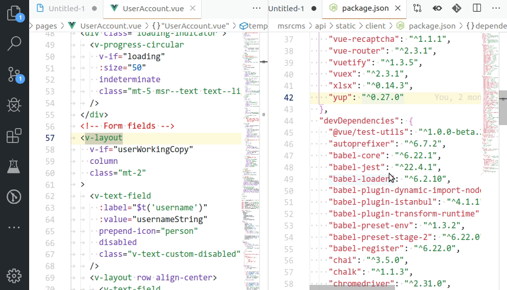

NOTE: This is now obsolete since the `workbench.action.toggleEditorWidths` has been released which does the exact same thing using a native implementation instead of chaining editor commands. Use that instead.

# vscode-toggle-max-editor

- This extension exposes the `togglemaxeditor.toggleMaximizeEditor` command that you can use to maximize/normalize an editor tab with a single key.
- It currently uses existing commands which unfortunately only partially maximize.
- The sidebar is hidden when maximizing.

## Credits

The actual toggle function is gratefully extracted from: https://github.com/DavidBabel/clever-vscode
